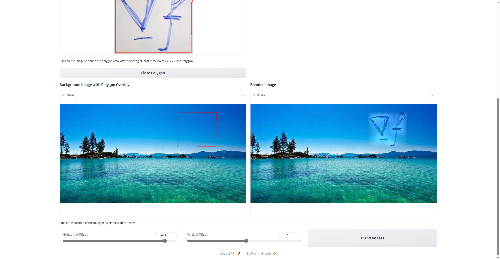
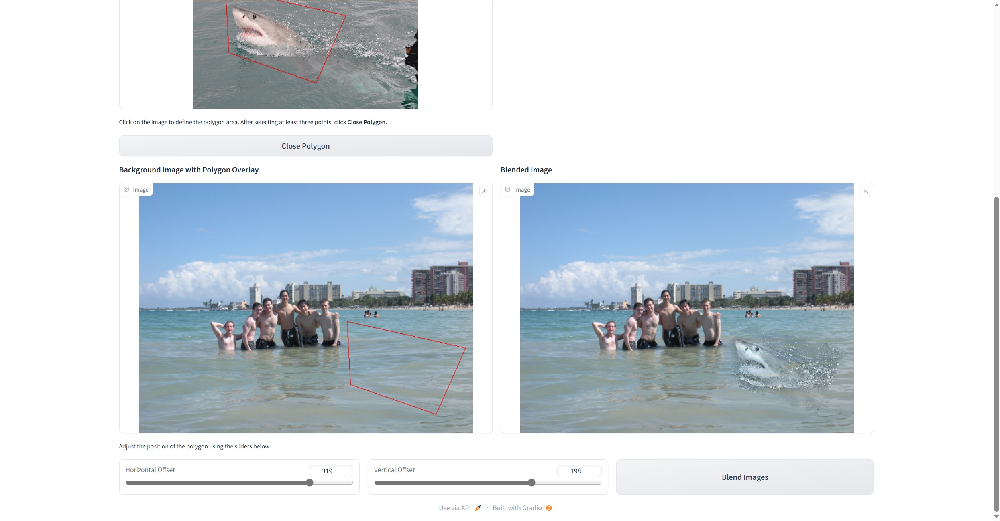
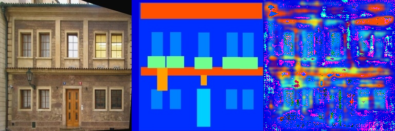

## Implementation of traditional DIP (Poisson Image Editing) and deep learning-based DIP (Pix2Pix) with PyTorch.

This repository is Yifei Li's implementation of Assignment_02 of DIP. 

## Requirements

需要安装anaconda3-2024.06-1以及pytorch.

To install requirements:

```setup
python -m pip install -r requirements.txt
```

Dataset:facades_dataset

## Running

To run Poisson Image Editing, run:

```Poisson Image Editing
run_blending_gradio.py
```

To run Pix2Pix, run:

```Pix2Pix
train.py
```

## Results (need add more result images)
### Poisson Image Editing



### Pix2Pix:

采用了全卷积网络，最大通道数为512，但生成的结果很差，loss有0.3左右
