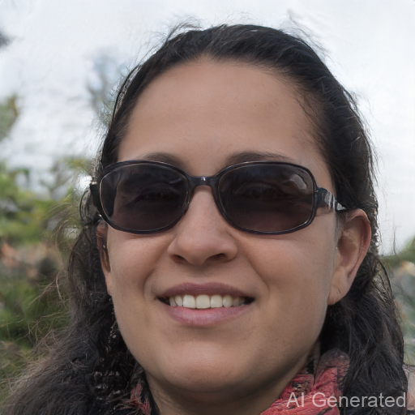
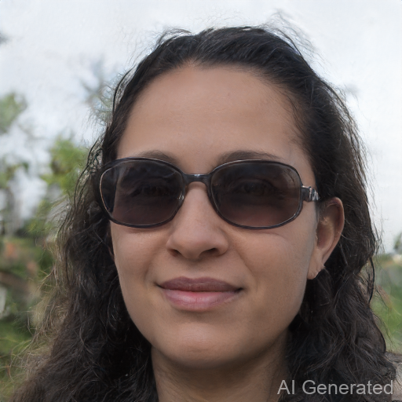

# Assignment 3 - Automatic Portrait Editor

### 本次作业采用了DrawGAN与dlib, 实现了一个自动肖像编辑器功能.

### Resources:
- [DragGAN](https://vcai.mpi-inf.mpg.de/projects/DragGAN/): [Implementaion 1](https://github.com/XingangPan/DragGAN)
- [Facial Landmarks Detection by dlib](https://github.com/davisking/dlib)

### 配置说明
本次作业以DrawGAN官方源码为基础，并在此基础上添加opencv-python库以及dlib库，dlib不支持最新的numpy库，需要指定numpy.__version__==1.26.4

DrawGAN配置可参照官方源码，在Windows平台安装有诸多bug，已知的有:

需要在本地安装与虚拟环境版本一致的CUDA

读取字体的大小的函数getsize()被弃用，需要更改为getbbox()

需要安装setuptools

### 算法说明
可下载68人脸特征点检测训练模型(https://github.com/davisking/dlib-models/blob/master/shape_predictor_68_face_landmarks.dat.bz2/)

并以此对图片中人脸特征点进行检测

特征点示例如下:

以瘦脸为例，我们仅需将DrawGAN的输入点分别设置为5号特征点以及12号特征点

目标点分别设置为5号特征点向右偏移k个像素(k=25)，12号特征点向左偏移k个像素(k=25)

其他的编辑功能也仅需对特定的语言特征点进行相应的编辑

如下图所示：

注意：需要在viz\drag_widget.py文件夹中添加这一功能(可将手动add_point绑定的函数替换为上述功能)

### 结果展示
自动瘦脸功能如下,分别为输入及输出：

