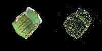

# Assignment 4 - Implement Simplified 3D Gaussian Splatting

本次作业目的为实现简易版的3D Gaussian Splatting

### Resources:
- [Paper: 3D Gaussian Splatting](https://repo-sam.inria.fr/fungraph/3d-gaussian-splatting/)
- [3DGS Official Implementation](https://github.com/graphdeco-inria/gaussian-splatting)
- [Colmap for Structure-from-Motion](https://colmap.github.io/index.html)

---

### Step 1. Structure-from-Motion
首先需要通过colmap从多视角图片获得稀疏点云:




### Step 2. A Simplified 3D Gaussian Splatting 

#### 2.1 3D Gaussians Initialization
需要给定3D Gaussians的各项参数作为初始化，初始中心选择为稀疏点云中心，协方差矩阵设置为旋转矩阵与缩放矩阵的积:

 '''
    Covs3d = R @ S @ S @ R.transpose(-1, -2)
 '''

#### 2.2 Project 3D Gaussians to Obtain 2D Gaussians
According to equation (5), we need to project the 3D Gaussians to the image space by transforming with the world to camera transformation *_W_* and the Jacobian matrix *_J_* of the projection transformation. You need to fill [the code here](gaussian_renderer.py#L26) for computing the projection.

#### 2.3 Compute the Gaussian Values
We need to compute 2D Gaussians for volume rendering. A 2D Gaussian is represented by:

$$
  f(\mathbf{x}; \boldsymbol{\mu}\_{i}, \boldsymbol{\Sigma}\_{i}) = \frac{1}{2 \pi \sqrt{ | \boldsymbol{\Sigma}\_{i} |}} \exp \left ( {-\frac{1}{2}} (\mathbf{x} - \boldsymbol{\mu}\_{i})^T \boldsymbol{\Sigma}\_{i}^{-1} (\mathbf{x} - \boldsymbol{\mu}\_{i}) \right ) = \frac{1}{2 \pi \sqrt{ | \boldsymbol{\Sigma}\_{i} |}} \exp \left ( P_{(\mathbf{x}, i)} \right )
$$

Here, $\mathbf{x}$ is a 2D vector representing the pixel location, $\boldsymbol{\mu}$ represents a 2D vector representing the mean of the $i$-th 2D Gaussian, and $\boldsymbol{\Sigma}$ represents the covariance of the 2D Gaussian. The exponent part $P_{(\mathbf{x}, i)}$ is:

$$
  P_{(\mathbf{x}, i)} = {-\frac{1}{2}} (\mathbf{x} - \boldsymbol{\mu}\_{i})^T \mathbf{\Sigma}\_{i}^{-1} (\mathbf{x} - \boldsymbol{\mu}\_{i})
$$

You need to fill [the code here](gaussian_renderer.py#L61) for computing the Gaussian values.

#### 2.4 Volume Rendering (α-blending)
According to equations (1-3), using these `N` ordered 2D Gaussians, we can compute their alpha and transmittance values at each pixel location in an image.

The alpha value of a 2D Gaussian $i$ at a single pixel location $\mathbf{x}$ can be calculated using:


$$
  \alpha_{(\mathbf{x}, i)} = o_i*f(\mathbf{x}; \boldsymbol{\mu}\_{i}, \boldsymbol{\Sigma}\_{i})
$$


Here, $o_i$ is the opacity of each Gaussian, which is a learnable parameter.

Given `N` ordered 2D Gaussians, the transmittance value of a 2D Gaussian $i$ at a single pixel location $\mathbf{x}$ can be calculated using:

$$
  T_{(\mathbf{x}, i)} = \prod_{j \lt i} (1 - \alpha_{(\mathbf{x}, j)})
$$

Fill [the code here](gaussian_renderer.py#L83) for final rendering computation.

After implementation, build your 3DGS model:
```
python train.py --colmap_dir data/chair --checkpoint_dir data/chair/checkpoints
```

### Compare with the original 3DGS Implementation
Since we use a pure PyTorch implementation, the training speed and GPU memory usage are far from satisfactory. Also, we do not implement some crucial parts like adaptive Gaussian densification scheme. Run the [original 3DGS implementation](https://github.com/graphdeco-inria/gaussian-splatting) with the same dataset to compare the results.


