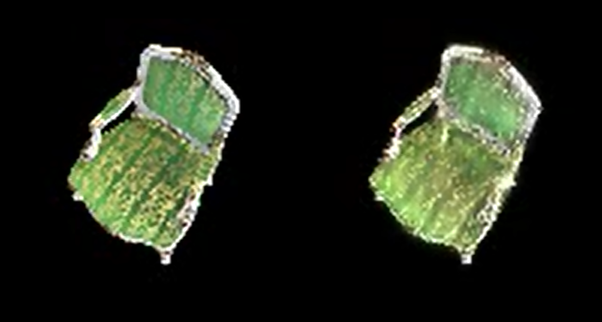

# Assignment 4 - Implement Simplified 3D Gaussian Splatting

本次作业目的为实现简易版的3D Gaussian Splatting

### Resources:
- [Paper: 3D Gaussian Splatting](https://repo-sam.inria.fr/fungraph/3d-gaussian-splatting/)
- [3DGS Official Implementation](https://github.com/graphdeco-inria/gaussian-splatting)
- [Colmap for Structure-from-Motion](https://colmap.github.io/index.html)

---

### Step 1. Structure-from-Motion
首先需要通过colmap从多视角图片获得稀疏点云:


### Step 2. A Simplified 3D Gaussian Splatting 

#### 2.1 3D Gaussians Initialization
需要给定3D Gaussians的各项参数作为初始化，初始中心选择为稀疏点云中心，协方差矩阵设置为旋转矩阵与缩放矩阵的积:

```
    Covs3d = R @ S @ S @ R.transpose(-1, -2)
```

#### 2.2 Project 3D Gaussians to Obtain 2D Gaussians
将3D Gaussians通过投影变换得到二维高斯:
```
        N = means3D.shape[0]
        cam_points = means3D @ R.T + t.unsqueeze(0)  # (N, 3)
        depths = cam_points[:, 2].clamp(min=1.)
        screen_points = cam_points @ K.T
        means2D = screen_points[..., :2] / screen_points[..., 2:3]

        J_proj = torch.zeros((N, 2, 3), device=means3D.device)
        J_proj[:, 0, 0] = 1.0 / cam_points[:, 2]
        J_proj[:, 1, 1] = 1.0 / cam_points[:, 2]
        J_proj[:, 0, 2] = -cam_points[:, 0] / (cam_points[:, 2] ** 2)
        J_proj[:, 1, 2] = -cam_points[:, 1] / (cam_points[:, 2] ** 2)

        covs_cam = torch.bmm(R.unsqueeze(0).expand(N, -1, -1), torch.bmm(covs3d, R.T.unsqueeze(0).expand(N, -1, -1)))
        covs2D = torch.bmm(J_proj, torch.bmm(covs_cam, J_proj.permute(0, 2, 1)))
```

#### 2.3 Compute the Gaussian Values
计算2D高斯用于体渲染. 2D高斯表示如下:

$$
  f(\mathbf{x}; \boldsymbol{\mu}\_{i}, \boldsymbol{\Sigma}\_{i}) = \frac{1}{2 \pi \sqrt{ | \boldsymbol{\Sigma}\_{i} |}} \exp \left ( {-\frac{1}{2}} (\mathbf{x} - \boldsymbol{\mu}\_{i})^T \boldsymbol{\Sigma}\_{i}^{-1} (\mathbf{x} - \boldsymbol{\mu}\_{i}) \right ) = \frac{1}{2 \pi \sqrt{ | \boldsymbol{\Sigma}\_{i} |}} \exp \left ( P_{(\mathbf{x}, i)} \right )
$$

Here, $\mathbf{x}$ is a 2D vector representing the pixel location, $\boldsymbol{\mu}$ represents a 2D vector representing the mean of the $i$-th 2D Gaussian, and $\boldsymbol{\Sigma}$ represents the covariance of the 2D Gaussian. The exponent part $P_{(\mathbf{x}, i)}$ is:

$$
  P_{(\mathbf{x}, i)} = {-\frac{1}{2}} (\mathbf{x} - \boldsymbol{\mu}\_{i})^T \mathbf{\Sigma}\_{i}^{-1} (\mathbf{x} - \boldsymbol{\mu}\_{i})
$$

通过如下代码计算2D高斯:
```
        N = means2D.shape[0]
        H, W = pixels.shape[:2]

        dx = pixels.unsqueeze(0) - means2D.reshape(N, 1, 1, 2)
        eps = 1e-4
        covs2D = covs2D + eps * torch.eye(2, device=covs2D.device).unsqueeze(0)

        inv_covs = torch.inverse(covs2D)
        det_covs = torch.det(covs2D).clamp(min=1e-6)

        dx = dx.unsqueeze(-1)
        mahalanobis_dist = torch.matmul(dx.transpose(-2, -1), torch.matmul(inv_covs.unsqueeze(1).unsqueeze(1), dx))
        mahalanobis_dist = mahalanobis_dist.squeeze(-1).squeeze(-1)

        gaussian = torch.exp(-0.5 * mahalanobis_dist) / (2 * np.pi * torch.sqrt(det_covs)).view(N, 1, 1)
```

#### 2.4 Volume Rendering (α-blending)
通过体渲染获得最终的图片

The alpha value of a 2D Gaussian $i$ at a single pixel location $\mathbf{x}$ can be calculated using:


$$
  \alpha_{(\mathbf{x}, i)} = o_i*f(\mathbf{x}; \boldsymbol{\mu}\_{i}, \boldsymbol{\Sigma}\_{i})
$$


Here, $o_i$ is the opacity of each Gaussian, which is a learnable parameter.

Given `N` ordered 2D Gaussians, the transmittance value of a 2D Gaussian $i$ at a single pixel location $\mathbf{x}$ can be calculated using:

$$
  T_{(\mathbf{x}, i)} = \prod_{j \lt i} (1 - \alpha_{(\mathbf{x}, j)})
$$

权重计算如下:
```
        weights = alphas * torch.cumprod(1 - alphas + 1e-4, dim=0).roll(1, dims=0)
        weights[0] = alphas[0]
```

### 结果
本次实验一半时间用在安装colmap以及pytorch3d上，电脑为RTX 2060显卡，训练时长7小时，以下是第一个epoch的结果以及第100个epoch的结果:


